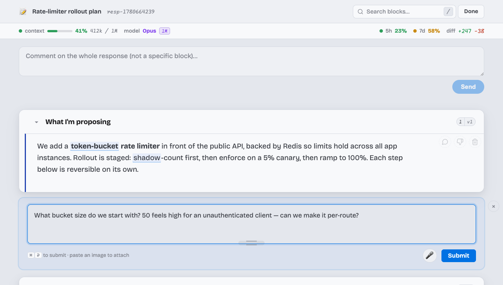
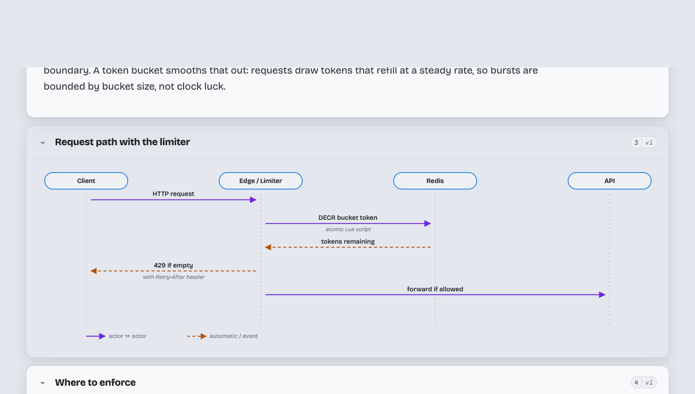

# petros-skills

Personal cross-project Claude Code skills and a sandbox for experimentation.

## ✨ Featured: `/annotate` — stop scrolling Claude's wall of text. Start arguing with it.

Claude's best answers — rollout plans, design reviews, multi-step analyses — show up in your terminal as one long scroll. Want to push back on step 3? You re-type the context, hope Claude finds the right paragraph, and get a fresh wall of text back.

**`/annotate` turns that monologue into a working session.** The response opens as a web page where every claim is its own card. Click one, leave a comment, and Claude rewrites *just that block* — in place, no reload, no re-pasting. The rest of the document stays put.



- **Live stats bar up top** — context window %, model, 5h / 7d rate-limit windows, and the session diff, mirrored straight from your terminal statusline. You watch the cost of the conversation while you read it.
- **Comment on any block** — click, type, submit. Claude folds your answer back into the prose. Disagree? Hit reject. Irrelevant? Dismiss it and Claude re-threads the rest.
- **Not just text** — responses render as sequence diagrams, comparison tables, and pick-one decision blocks when that beats prose. Project jargon gets hover-glossary definitions.



- **Zero install** — a stdlib-only Python server. Nothing to `pip install`, nothing to configure. Run `/annotate` and it's there.

Type `/annotate` after any big response, or just let it route long answers automatically. [Full skill docs →](skills/annotate/)

## What's in here

- `skills/` — individual skills, one directory each. `_template/` is a starting template (leading underscore sorts it to the top).
- `hooks/` — plugin hooks: `auto-refine.sh` (UserPromptSubmit) injects the refine-prompt evaluation reminder for every user message. The annotate skill's browser-submission wait is now an in-session `Monitor` watcher (no blocking Stop hook).
- `output-styles/` — custom output styles shipped by the plugin.
- `git-hooks/` — repo-local git hooks. `pre-commit-claude-scan` runs Claude over every staged diff to catch secrets / private paths before they're committed. Install with `./install-git-hooks`.
- `.claude-plugin/` — plugin manifest (`plugin.json`) and local marketplace entry (`marketplace.json`).

## Install

**One time, from anywhere on your machine.** Once installed the plugin is enabled globally — every Claude Code session everywhere will get its skills, hooks, and output styles. You do **not** need to repeat this per project.

In a Claude Code session, run these slash commands (not shell commands):

```
/plugin marketplace add $HOME/projects/petros-skills
/plugin install petros-skills@petros-skills
```

Then restart Claude Code (or run `/reload-plugins`). Verify with `/plugin` — `petros-skills` should appear as enabled.

> If the cwd of the Claude session you run the commands from happens to be this repo, `./` works in place of the absolute path. Either way, the marketplace registration is stored in `~/.claude/settings.json` and persists across projects.

## Live-edit mode (for working on this plugin)

`/plugin install` copies the source into `~/.claude/plugins/cache/...`, so edits in this repo don't propagate — you'd have to `/plugin update` after every change. To avoid that, run once:

```
./install-as-symlink
```

This replaces the cached copy with a symlink back to this working tree. From then on, every edit is live — just `/reload-plugins` in Claude Code to pick it up. Re-run the script if a future `/plugin update` ever overwrites the symlink with a fresh copy.

Skip this if you're just *using* the plugin and not editing it.

## Disable per project

Hooks fire in *every* project once the plugin is installed. To opt a single project out, add to that project's `.claude/settings.json`:

```json
{
  "enabledPlugins": {
    "petros-skills@petros-skills": false
  }
}
```

To uninstall everywhere: `/plugin uninstall petros-skills@petros-skills`.

## Skills

- **`/annotate`** (`skills/annotate/`) — Long Claude responses (plans, analyses, lists of findings) get pushed to a local browser page where you highlight any text and leave free-text comments. The annotations come back to Claude on its next turn. Stdlib-only Python server, no installs.
- **`/humanize`** (`skills/humanize/`) — Rewrite Claude-generated markdown so it reads like a long-time colleague wrote it. Manual only — invoked when you type `/humanize` or ask to "derobotize" something.
- **`/refine-prompt`** (`skills/refine-prompt/`) — Turns messy speech-to-text transcripts into high-quality coding prompts via a normalize → probe → classify → compose pipeline. Two modes: explicit `/refine-prompt` refines your clipboard (or a file/inline text) inside a subagent and copies a bare, paste-ready prompt back to the clipboard without polluting the session or executing it; the in-chat auto-refine path (via the `auto-refine` hook) refines a rambling message in place and runs it after you reply `go`.

## Hooks

- **`auto-refine`** (`hooks/auto-refine.sh`) — UserPromptSubmit hook. Injects a system reminder telling Claude to evaluate each user message against the `refine-prompt` skill's messiness heuristic, refine when speech-to-text-like, skip on clean or mid-flow prompts, and treat the approved refined prompt as canonical for the rest of the session.

## Git hooks (this repo only)

Install once per clone:

```
./install-git-hooks
```

This symlinks `git-hooks/pre-commit-claude-scan` into `.git/hooks/pre-commit`. On every commit it pipes the staged diff into `claude -p` and asks it to flag anything that looks private — API keys, hardcoded `/Users/<name>/` paths, internal URLs, pasted chat logs, etc. Output is `PASS` or `FAIL: <reason>`. `FAIL` blocks the commit.

Bypass once: `git commit --no-verify`. Disable for a single commit: `SKIP_CLAUDE_SCAN=1 git commit ...`. If the `claude` CLI isn't on PATH the hook prints a warning and lets the commit through.

## Output styles

- **`clean`** (`output-styles/clean.md`) — Summary-first answers for an engineering lead, with no unexplained jargon (every unfamiliar term is defined or replaced before sending). Opt-in via `/output-style clean`.

## Add a new skill

1. Copy `skills/_template/` to `skills/<your-skill-name>/` (drop the leading underscore).
2. Edit `SKILL.md` frontmatter (`name`, `description`, `allowed-tools`) to match the new directory name.
3. Run `/reload-plugins` in Claude Code to pick up the change.
One note to add is that we should not update a block in isolation but do a coherency pass to the whole document too.
Optimize for token consumptions

